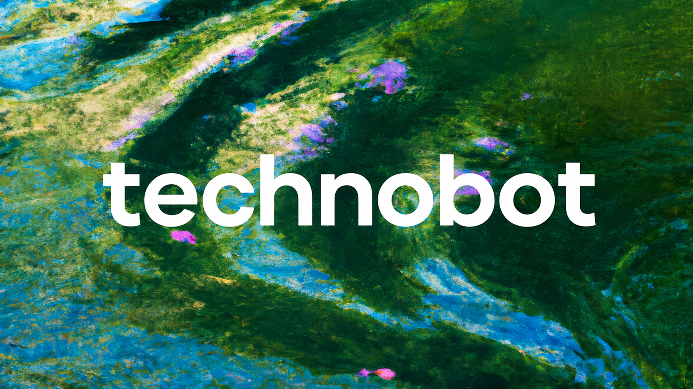

Full-stack robotics tournament management system built with NestJS, Hexagonal Architecture, and the Supabase native SDK.

## Technology Stack
- **Backend**: NestJS (Node.js)
- **Frontend**: React (Vite)
- **Database**: PostgreSQL (Supabase)
- **Infrastructure**: Docker & GitHub Actions
- **Security**: Supabase Row Level Security (RLS)

## Getting Started

### Prerequisites
- Docker & Docker Compose
- Node.js 20+
- A Supabase project

### Configuration
Create a `.env` file at the root with your Supabase credentials:
```env
SUPABASE_URL=your-project-url
SUPABASE_SERVICE_ROLE_KEY=your-service-role-key
```

### Development
Launch the development environment:
```bash
docker compose -f docker-compose.dev.yml up --build
```
The API will be available at `http://localhost:3000`.

### Database Setup
To initialize the database schema and security policies:
```bash
node setup_database.js
```

## Architecture

The project follows **Hexagonal Architecture** principles:
- `domain`: Core business logic and entities.
- `application`: Use cases and orchestration.
- `infrastructure`: Concrete implementations (Supabase repository, NestJS controllers).

## Security (RLS)

Security is handled directly in the database using Supabase **Row Level Security**. Policies are defined for different roles:
- `admin`: Full access.
- `organisateur`: Management access (no audit logs).
- `jury`: Score entry and planning access.
- `enseignant`: School-specific team management.
- `eleve`: Personal team and score views.

## CI/CD

Automated pipelines are configured via GitHub Actions (`.github/workflows/ci-cd.yml`) for:
- Building and testing the API and Web applications.
- Building and pushing Docker images to GHCR.
